# EASPayments – Distributed Payment Transaction Processor

**Tech Stack:** FastAPI · PostgreSQL · Redis · Docker · gRPC · REST · Python (async) 

## 1. Project Overview

EASPayments is a simplified electronic payment system designed to handle financial transactions between user accounts. It is built using a microservices architecture, where different parts of the system are broken down into independent services that communicate with each other. This design allows for scalability, resilience, and easier maintenance of individual components.

The core functionalities of the system include:
-   Transferring funds between accounts.
-   Checking account balances.
-   Notifying users of transactions.
-   Providing a simple web interface to view ledger activity.

## 2. System Architecture

The system is composed of three main services, a database, a cache, and a user interface, all orchestrated using Docker Compose.

-   **Gateway Service:** The public-facing entry point for all client requests. It exposes a REST API for the UI and communicates with the backend services (`Ledger` and `Notifications`) via gRPC.
-   **Ledger Service:** The core of the system, responsible for all financial logic. It maintains the ledger of all transactions and account balances. It communicates only via gRPC.
-   **Notifications Service:** A simple service responsible for sending notifications to users about their transactions. It communicates only via gRPC.
-   **PostgreSQL Database:** The primary data store for the `Ledger` and `Gateway` services.
-   **Redis:** Used for caching and distributed locking to handle concurrent requests safely.
-   **UI:** A simple HTML/CSS/JavaScript frontend that interacts with the `Gateway` service's REST API.

### Communication Flow

1.  The **User Interface (UI)** sends REST API requests to the **Gateway Service**.
2.  The **Gateway Service** validates the request and then makes gRPC calls to the appropriate backend service (`Ledger` or `Notifications`).
3.  The **Ledger Service** interacts with the **PostgreSQL Database** to perform financial transactions and queries.
4.  The **Gateway Service** uses **Redis** for idempotency checks and to manage distributed locks, preventing race conditions like double-spending.
5.  After a successful transfer, the **Gateway Service** asynchronously calls the **Notifications Service** to send a notification.

```mermaid
graph TD
    %% DARK MODE THEME
    subgraph "User Facing"
        style 'User Facing' fill:#1e1e1e,stroke:#8ab4f8,stroke-width:2px
        A[UI / API Client]
        style A fill:#2e2e2e,stroke:#8ab4f8,stroke-width:1.5px,color:#e8eaed
    end

    subgraph "EAS"
        style Gateway fill:#1e1e1e,stroke:#34c759,stroke-width:2px
        subgraph Gateway
            B[REST API Endpoints]
            C[Idempotency Check]
            D[Distributed Lock]
            E[gRPC Clients]
            style B fill:#2c2c2c,stroke:#34c759,color:#e8eaed
            style C fill:#2c2c2c,stroke:#34c759,color:#e8eaed
            style D fill:#2c2c2c,stroke:#34c759,color:#e8eaed
            style E fill:#2c2c2c,stroke:#34c759,color:#e8eaed
        end

        style Ledger fill:#1e1e1e,stroke:#fbbc04,stroke-width:2px
        subgraph Ledger
            F[gRPC Server]
            G[Transaction Logic]
            style F fill:#2c2c2c,stroke:#fbbc04,color:#e8eaed
            style G fill:#2c2c2c,stroke:#fbbc04,color:#e8eaed
        end

        style Notifications fill:#1e1e1e,stroke:#ff5e5e,stroke-width:2px
        subgraph Notifications
            H[gRPC Server]
            I[Notification Logic]
            style H fill:#2c2c2c,stroke:#ff5e5e,color:#e8eaed
            style I fill:#2c2c2c,stroke:#ff5e5e,color:#e8eaed
        end

        subgraph "Data Stores"
            J[PostgreSQL]
            K[Redis]
            style J fill:#2c2c2c,stroke:#8ab4f8,color:#e8eaed
            style K fill:#2c2c2c,stroke:#d85a7f,color:#e8eaed
        end
    end

    A -- "REST API Call" --> B
    B --> C
    C -- "Check Idempotency Key" --> J
    C --> D
    D -- "Acquire/Release Lock" --> K
    D --> E
    E -- "gRPC Call" --> F
    F --> G
    G -- "Read/Write" --> J
    E -- "gRPC Call (Async)" --> H
    H --> I

```



## 3. File-by-File Breakdown

### Root Directory

-   `docker-compose.yml`: Defines and configures all the services (`gateway`, `ledger`, `notifications`, `postgres`, `redis`) and their relationships, networks, ports, and volumes. This is the main file for orchestrating the entire application stack.
-   `pyproject.toml`: A placeholder for Python project metadata, typically used with modern Python packaging tools. In this project, dependencies are managed in `requirements.txt` files within each service.
-   `README.md`: The main documentation file for the project.

### `gateway/`

This service acts as the API gateway, handling incoming HTTP requests and delegating them to the appropriate microservice.

-   `app.py`: The main FastAPI application file. It defines the REST API endpoints (`/transfer`, `/balance/{account_id}`, `/ledger_entries`, etc.) and orchestrates the calls to the `ledger` and `notifications` services.
-   `grpc_clients.py`: Contains the client-side logic for making gRPC calls to the `ledger` and `notifications` services. It handles the creation of gRPC stubs and channels.
-   `db.py`: Defines the database schema for the tables used by the `gateway` service (`accounts`, `idempotency_keys`) using SQLAlchemy Core.
-   `idempotency.py`: Implements idempotency checks using the database to ensure that the same transfer request, if retried, is not processed multiple times.
-   `redis_lock.py`: Provides functionality for acquiring and releasing distributed locks on accounts using Redis. This is crucial for preventing race conditions during transfers.
-   `config.py`: Manages configuration settings for the gateway, such as database connection details and gRPC target addresses, using Pydantic.
-   `schemas.py`: Defines the Pydantic models for API request and response validation.
-   `Dockerfile`: The build recipe for the `gateway` service container. It installs dependencies, copies source code, and generates the gRPC client stubs.
-   `requirements.txt`: Lists the Python dependencies for the `gateway` service.

### `ledger/`

This service is the heart of the payment system, responsible for the core financial logic.

-   `server.py`: The main gRPC server for the `ledger` service. It implements the `LedgerService` interface defined in `payment.proto`, handling requests for transfers and balance checks.
-   `crud.py`: Contains the core database logic (Create, Read, Update, Delete) for the ledger. It has functions for recording transfers, getting balances, and retrieving all ledger entries.
-   `db.py`: Defines the database schema for the `ledger` service's tables (`accounts`, `ledger_entries`) and handles database connections.
-   `migrations.sql`: Contains the initial SQL statements to set up the database schema.
-   `Dockerfile`: The build recipe for the `ledger` service container.
-   `requirements.txt`: Lists the Python dependencies for the `ledger` service.

### `notifications/`

A simple service for sending notifications.

-   `server.py`: The main gRPC server for the `notifications` service. It implements the `NotificationService` and, in a real-world scenario, would contain logic to send emails, push notifications, or SMS messages. In this project, it simply logs the notification.
-   `Dockerfile`: The build recipe for the `notifications` service container.
-   `requirements.txt`: Lists the Python dependencies for the `notifications` service.

### `proto/`

-   `payment.proto`: The Protocol Buffers definition file. It defines the gRPC services (`LedgerService`, `NotificationService`) and the message formats (`TransferRequest`, `BalanceResponse`, etc.) used for communication between the microservices. This file acts as the contract between the services.

### `scripts/`

This directory contains utility scripts for setting up, testing, and managing the application.

-   `create_accounts.py`: This script is used to initialize the system with a set of predefined accounts (Alice and Bob). It makes API calls to the `gateway` service to create these accounts in the database. This is essential for having a baseline to perform transfers and tests. It ensures the system has initial users with balances.
-   `load_test.py`: This script is a simple, asynchronous load tester designed to simulate concurrent transfer requests against the `gateway` service. It performs the following:
    -   **Concurrency:** Spawns multiple asynchronous tasks (`asyncio.create_task`) to send transfer requests in parallel, mimicking real-world user traffic.
    -   **Idempotency Testing:** It intentionally includes logic to reuse idempotency keys for some requests, verifying that the gateway's idempotency mechanism correctly prevents duplicate processing of the same logical transaction.
    -   **Balance Verification:** It fetches and prints account balances before and after the load test, allowing you to observe the cumulative effect of the transfers and confirm that balances are correctly updated.
    -   **Purpose:** This script is crucial for verifying the system's stability, concurrency control (distributed locking), and idempotency under load. It helps identify race conditions or other issues that might not appear under single-threaded testing.
-   `wait_for_db.py`: A helper script used in `docker-compose.yml` to ensure the PostgreSQL database is fully ready and accepting connections before dependent services (like `ledger` and `gateway`) attempt to connect. This prevents startup failures due to database unavailability.

### `UI/`

-   `index.html`: The main HTML file for the web interface.
-   `style.css`: The stylesheet for the UI.
-   `script.js`: The JavaScript code that makes API calls to the `gateway` service to fetch and display ledger data.

## 4. Database Schema

The system uses a PostgreSQL database with the following main tables:

-   **`accounts`**: Stores information about each user account.
    -   `id` (UUID, Primary Key): The unique identifier for the account.
    -   `start_balance` (Integer): The initial balance of the account.
    -   `currency` (String): The currency of the account (e.g., "INR").
-   **`ledger_entries`**: Records every transaction that occurs.
    -   `id` (Integer, Primary Key): The unique identifier for the entry.
    -   `tx_id` (UUID): The identifier for the transaction group (a single transfer involves two entries, a debit and a credit, linked by the same `tx_id`).
    -   `account_id` (UUID, Foreign Key to `accounts.id`): The account involved in the entry.
    -   `direction` (String): "DEBIT" or "CREDIT".
    -   `amount` (Integer): The amount of the transaction.
    -   `created_at` (Timestamp): The timestamp of the entry.
-   **`idempotency_keys`**: Used by the `gateway` to track processed requests and prevent duplicates.
    -   `key` (String, Primary Key): The idempotency key provided by the client.
    -   `status` (String): The status of the transaction ("SUCCESS" or "FAILED").
    -   `response` (JSON): The response that was sent to the client.

## 5. API Communication

### REST API (Gateway)

-   `POST /transfer`: Initiates a new transfer.
-   `GET /balance/{account_id}`: Retrieves the balance for a specific account.
-   `GET /ledger_entries`: Fetches all ledger entries.
-   `GET /accounts`: Retrieves all accounts.
-   `GET /idempotency_keys`: Retrieves all idempotency keys.

### gRPC API (Internal)

#### `LedgerService`

-   `rpc Transfer(TransferRequest) returns (TransferResponse)`: Executes a transfer between two accounts.
-   `rpc GetBalance(BalanceRequest) returns (BalanceResponse)`: Gets the balance for a single account.
-   `rpc GetAllEntries(GetAllRequest) returns (GetAllResponse)`: Gets all entries from the ledger.

#### `NotificationService`

-   `rpc Notify(NotificationRequest) returns (NotificationResponse)`: Sends a notification.

## 6. Trade-offs and Considerations

-   **Microservices vs. Monolith:** The microservices architecture adds complexity in terms of deployment and inter-service communication (gRPC, service discovery). However, it provides better scalability, fault isolation (if one service fails, others can remain operational), and allows teams to work on different services independently.
-   **gRPC vs. REST for Internal Communication:** gRPC was chosen for internal communication due to its high performance, use of binary serialization (Protocol Buffers), and strongly typed contracts. This is more efficient than using JSON-based REST for service-to-service calls.
-   **Idempotency:** The system implements idempotency at the gateway level. This is crucial for financial systems to prevent duplicate transactions when clients retry requests due to network issues.
-   **Concurrency Control:** The use of Redis for distributed locking is a key feature to prevent race conditions, such as a user trying to make multiple transfers from the same account simultaneously, which could lead to an incorrect balance.
-   **Database Transactions:** The `ledger` service uses database transactions to ensure that a transfer (which involves both a debit and a credit) is an atomic operation. If any part of the transfer fails, the entire transaction is rolled back, maintaining data consistency.
-   **Simplicity vs. Real-World Complexity:** This project is a simplified example. A real-world payment system would have more complex features like currency conversion, fraud detection, more robust security measures, and more detailed transaction statuses.

## 7. Distributed Systems Concepts in Detail

### Idempotency

**What it is:** In the context of this system, idempotency ensures that making the same API request multiple times has the same effect as making it once. This is critical in financial systems where a client might retry a transfer request due to a network error, and you must not debit the sender's account multiple times.

**How it's implemented:**
1.  **Client-side:** The client generates a unique `idempotency_key` (a UUID is a good choice) for each transfer operation.
2.  **Gateway-side (`gateway/idempotency.py`):**
    -   When a `/transfer` request is received, the gateway first checks if the provided `idempotency_key` exists in the `idempotency_keys` table in its database.
    -   **If the key exists and the status is "SUCCESS"**, it means the transaction has already been processed. The gateway immediately returns the saved response without re-processing the transfer.
    -   **If the key does not exist**, the gateway creates a new record in the `idempotency_keys` table with a placeholder status (e.g., "PENDING"). This marks the operation as in-progress.
    -   The gateway then proceeds with the transfer by calling the `ledger` service.
    -   **Upon completion**, the gateway updates the idempotency record with the final status ("SUCCESS" or "FAILED") and the response that was sent to the client.

**Trade-offs:**
-   **Performance:** This approach adds a database write and read for every transfer request, which introduces a small amount of latency. However, the safety guarantee against duplicate transactions is well worth this trade-off in a financial system.
-   **Storage:** Storing idempotency keys consumes database space. A cleanup strategy (e.g., a background job to delete old keys) might be needed in a high-volume system.

### Distributed Locking with Redis

**What it is:** When multiple clients try to transfer money from the same account at the same time, a race condition can occur. For example, a user with $100 in their account could try to send $100 to two different people simultaneously. Without locking, both transactions might read the initial balance of $100 and succeed, leading to a negative balance. Distributed locking prevents this by ensuring that only one operation can be performed on a given account at a time.

**How it's implemented (`gateway/redis_lock.py`):**
1.  Before processing a transfer, the gateway attempts to acquire a lock on both the `from_account` and the `to_account` using Redis.
2.  The lock is implemented as a key in Redis (e.g., `lock:account_id:<account_id>`) with a short time-to-live (TTL). The TTL is a safety measure to prevent a lock from being held indefinitely if the gateway crashes.
3.  **If the locks are acquired successfully**, the gateway proceeds with the transfer.
4.  **If the locks cannot be acquired** (because another operation already holds them), the gateway waits for a short period and retries. If it still can't get the locks, it returns a `409 Conflict` error to the client, who can then retry the request.
5.  **After the transfer is complete (or has failed)**, the gateway releases the locks, allowing other operations to proceed.

**Specific Redis Features Used:**
-   **`SETNX` Command:** The core of the locking mechanism is the `SETNX` (SET if Not eXists) command. `SETNX` is an atomic operation that sets a key to a value only if the key does not already exist. This allows a client to acquire a lock in a single, atomic step. If `SETNX` returns `1`, the lock is acquired. If it returns `0`, it means another client already holds the lock.
-   **Key Expiration (TTL):** When setting the lock, a time-to-live (TTL) is also set. This is crucial for preventing deadlocks. If a client acquires a lock and then crashes before releasing it, the TTL ensures that the lock is automatically released after a certain period, allowing other clients to proceed.
-   **`DEL` Command:** When an operation is complete, the `DEL` command is used to explicitly delete the lock key, releasing the lock for other clients.

**Trade-offs:**
-   **Complexity:** Distributed locking adds significant complexity to the system. It requires careful management of lock acquisition and release, and handling of edge cases like deadlocks (though less likely with a simple two-account lock).
-   **Performance:** Acquiring and releasing locks adds latency to each transfer. Redis is very fast, but it's still an extra network round trip.
-   **Single Point of Failure:** If Redis goes down, the locking mechanism fails. In a production system, a highly available Redis setup (e.g., Redis Sentinel or Cluster) would be required.

### Asynchronous Notifications

**What it is:** After a transfer is completed, the system needs to notify the sender and the receiver. This notification process should not block the response to the client who initiated the transfer. The client should get a confirmation of the transfer as quickly as possible, and the notifications can be sent in the background.

**How it's implemented (`gateway/app.py`):**
1.  After the `ledger` service successfully processes the transfer, the `gateway` service receives the response.
2.  Instead of directly calling the `notifications` service and waiting for it to complete, the gateway creates a new background task using `asyncio.create_task()`.
3.  This background task is responsible for making the gRPC calls to the `notifications` service for both the sender and the receiver.
4.  The main request-response flow in the gateway is not blocked by this and can immediately return a response to the client.

**Trade-offs:**
-   **Reliability:** This is a "fire-and-forget" approach. If the `notifications` service is down or the gateway crashes before the notification is sent, the notification will be lost. In a real-world system, a more robust solution like a message queue (e.g., RabbitMQ, Kafka) would be used. The gateway would publish a "transfer_completed" event to the queue, and the notifications service would be a consumer of that queue, ensuring that notifications are reliably delivered even if the service is temporarily unavailable.
-   **Observability:** It can be harder to monitor and debug background tasks. Proper logging within the notification task is essential.

## 8. Uniqueness of Identifiers

### Idempotency Keys

-   **Generation:** The `idempotency_key` is generated by the **client** that initiates the transfer request. The system relies on the client to provide a unique key for each distinct operation.
-   **Uniqueness Guarantee:** The uniqueness of the `idempotency_key` is the responsibility of the client. The standard and best practice is to use a **Universally Unique Identifier (UUID)**, specifically a version 4 UUID, which is generated from random numbers. The probability of a collision (two clients generating the same UUID) is astronomically low, making it a safe assumption for ensuring uniqueness in a distributed system.
-   **System's Role:** The EASPayments system does not generate the idempotency key; it consumes it. The `idempotency_keys` table in the database has a primary key constraint on the `key` column, which enforces uniqueness at the database level. If a client attempts to reuse an idempotency key for a different request, the system will either return the cached response of the original request or, if the original request is still in progress, the second request will be rejected.

### Transaction IDs (`tx_id`)

-   **Generation:** The `tx_id` is generated by the **`ledger` service** when a transfer is recorded. Specifically, the `record_transfer` function in `ledger/crud.py` creates a new `tx_id` using `str(uuid.uuid4())`.
-   **Uniqueness Guarantee:** The `tx_id` is a version 4 UUID generated on the server side. Just like with client-generated UUIDs, the randomness of the generation process makes the probability of a collision negligible. Since the `ledger` service is the single source of truth for creating transactions, it can guarantee that each new transfer operation receives a unique `tx_id`.
-   **Purpose:** The `tx_id` serves a different purpose than the idempotency key. While the idempotency key is for preventing duplicate *requests*, the `tx_id` is for grouping the *database entries* that make up a single, atomic transfer. A single transfer consists of two `ledger_entries` records: a DEBIT from the sender and a CREDIT to the receiver. Both of these records share the same `tx_id`, which allows the system to easily query for and reason about the complete transaction.

## Quick Start

```bash
git clone <your-clone-or-extract-zip>
cd EASPayments
docker compose up --build -d

# Initialize accounts
docker compose run --rm gateway python scripts/create_accounts.py

# Test a single transfer of 100 paise (₹1) from Alice -> Bob
curl -X POST http://localhost:8000/transfer   -H 'Content-Type: application/json'   -d '{"from_account":"00000000-0000-0000-0000-0000000000a1","to_account":"00000000-0000-0000-0000-0000000000b1","amount":100,"currency":"INR","idempotency_key":"demo-1"}'

# Get balances
curl http://localhost:8000/balance/00000000-0000-0000-0000-0000000000a1
curl http://localhost:8000/balance/00000000-0000-0000-0000-0000000000b1
```

### Load Testing

Run the built-in concurrency + idempotency stress test:

```bash
docker compose run --rm gateway python scripts/load_test.py
```

This script (`scripts/load_test.py`) is a simple, asynchronous load tester designed to simulate concurrent transfer requests against the `gateway` service. It performs the following:
-   **Concurrency:** Spawns multiple asynchronous tasks (`asyncio.create_task`) to send transfer requests in parallel, mimicking real-world user traffic.
-   **Idempotency Testing:** It intentionally includes logic to reuse idempotency keys for some requests, verifying that the gateway's idempotency mechanism correctly prevents duplicate processing of the same logical transaction.
-   **Balance Verification:** It fetches and prints account balances before and after the load test, allowing you to observe the cumulative effect of the transfers and confirm that balances are correctly updated.
-   **Purpose:** This script is crucial for verifying the system's stability, concurrency control (distributed locking), and idempotency under load. It helps identify race conditions or other issues that might not appear under single-threaded testing.

## Conclusion

This EASPayments project serves as a robust foundation and a valuable learning resource for understanding modern distributed systems design principles. Its usefulness extends beyond a simple demo, offering a clear starting point for various real-world applications:

### Usefulness as a Foundation:
-   **Microservices Best Practices:** Demonstrates a clear separation of concerns, inter-service communication via gRPC, and independent deployment units.
-   **Asynchronous Programming:** Showcases effective use of Python's `asyncio` and `FastAPI` for building high-performance, non-blocking services.
-   **Distributed System Challenges:** Provides practical examples of addressing common distributed system problems like idempotency and concurrency control using Redis and database transactions.
-   **Scalability:** The modular nature allows individual services to be scaled independently based on their load requirements.
-   **Observability:** Basic logging is in place, which can be extended with metrics and tracing for better system monitoring.
